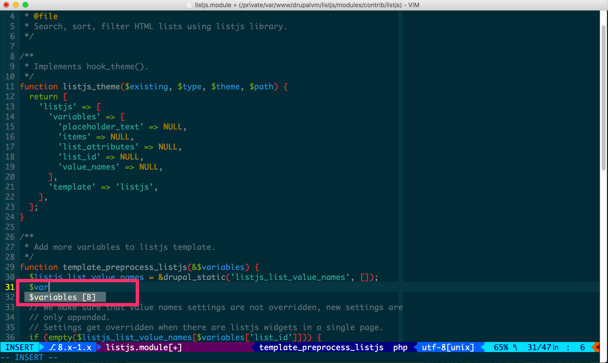
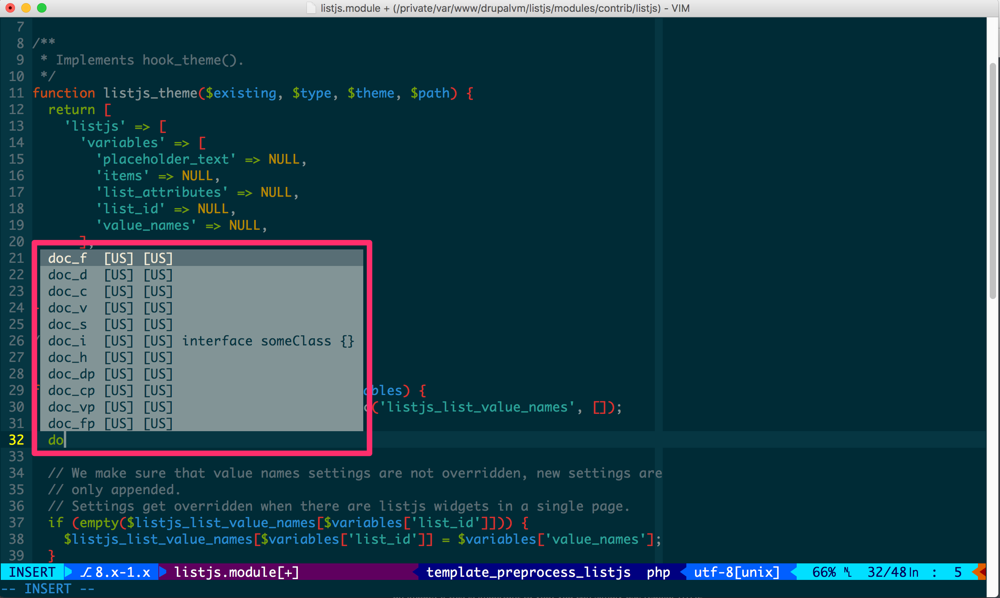
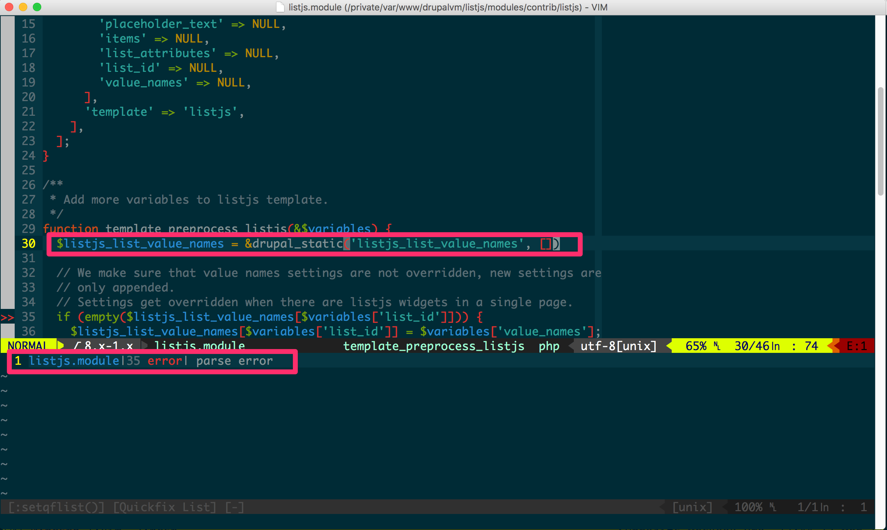

# Vim plugins and settings for Drupal development

Vim plugins and settings that will ease writing Drupal code in Vim. Other than
Drupal, these settings will also help you writing **PHP** and **JavaScript**.
The settings will also work in graphical Vim (recommended).

- [Installation](#installation)
- [Features](#features)
  - [Autocomplete](#autocomplete)
  - [Asynchronous syntax checker using](#asynchronous-syntax-checker-using-w0rpale)
  - [List of functions and variables](#list-of-functions-and-variables)
  - [View files and directories in project docroot](#view-files-and-directories-in-project-docroot)

## Installation
```
1. cd
2. mv ~/.vim ~/.vim-bak // If you have vim settings. Else, proceed to next step
3. git clone git@github.com:subhojit777/drupal-vim.git ~/.vim
4. git clone git@github.com:VundleVim/Vundle.vim.git ~/.vim/bundle/Vundle.vim
5. cp ~/.vim/vimrc ~/.vimrc
6. cp ~/.vim/gvimrc ~/.gvimrc // If you have graphical vim installed
7. mkdir ~/.vimsessions
8. mkdir ~/vimtmp
9. `sudo apt-get install exuberant-ctags` // Install exuberant-ctags on Ubuntu/Debian
10. `brew install ctags` // Install exuberant-ctags on OSX (Make sure you have [Homebrew](https://brew.sh/) installed)
11. vim +BundleInstall +qall
```

And you are good to go!

## Features
### Autocomplete




*Navigate* through the list using `<C-n>` (next), `<C-p>` (previous).

")

*Expand* it by pressing `tab` key.

### Asynchronous syntax checker using [`w0rp/ale`](https://github.com/w0rp/ale)


This is *triggered* on *file save*.

### List of functions and variables


*Trigger* it using *`<leader>tt`*.

### View files and directories in project docroot


*Trigger* it using *`<leader>ntt`*.

This also uses [`jistr/vim-nerdtree-tabs`](https://github.com/jistr/vim-nerdtree-tabs), so the state is maintained across tabs.

And many **[other features](http://subhojit777.in/use-vim-as-ide-for-drupal-development)**.

**Feel free to create issues [here](https://github.com/subhojit777/drupal-vim/issues/new) if you are having problem during the setup.**

**Pull requests are welcome for bugs/new features :)**

Thanks for flying Vim :)
